<div align="center">


<h1>Multi-Cloud Billing Dashboard</h1>

<p><strong>The Institutional-Grade Platform for Global FinOps, Multi-Cloud Cost Optimization, and Cloud Economics Orchestration</strong></p>

[]()
[]()
[]()
[]()

<br/>

> **"Visibility is the first pillar of FinOps; Optimization is the goal."** 
> Multi-Cloud Billing Dashboard is a flagship solution for FinOps Practitioners, Cloud Economists, and Engineering Leaders. By aggregating costs across AWS, Azure, and GCP into a unified model, it enables organizations to achieve institutional-scale transparency and automated cost governance.

</div>

---

## 🏛️ Executive Summary

The **Multi-Cloud Billing Dashboard Platform** is a specialized flagship solution designed for Global Enterprises, Finance Business Units, and SRE Organizations. As organizations distribute workloads across multiple clouds, the fragmentation of billing data (AWS CUR, Azure Consumption, GCP BigQuery) creates an existential lack of visibility. This platform addresses these complexities using a cloud-native, "economics-first" framework.

This platform provides a **Unified Multi-Cloud Cost Plane**. It demonstrates how to orchestrate institutional FinOps—using **FastAPI**, **React 18**, **PostgreSQL**, and **Terraform**—to create a "Cost-Conscious" engineering culture. By providing **Cost Normalization**, **Tag-Based Allocation**, **Predictive Forecasting**, and **Automated Optimization**, it enables organizations to move from "Uncontrolled Spend" to "Unit Economics Excellence."

---

## 📉 The "Cloud Spend Fragmentation" Problem

Enterprises scaling multi-cloud environments face existential challenges:
- **Billing Data Silos**: Each cloud provider has a unique data format, making it impossible to answer "How much did Service X cost globally?"
- **Allocation Gaps**: Lack of consistent tagging and resource ownership leads to "Untagged Spend" and budget accountability issues.
- **Forecasting Blindness**: Manual spreadsheets are insufficient for predicting complex, variable cloud costs, leading to budget surprises.
- **Optimization Inertia**: Without a central hub for savings recommendations (RIs, SPs, Rightsizing), organizations leave millions in "Cloud Waste" on the table.

---

## 🚀 Strategic Drivers & Business Outcomes

### 🎯 Strategic Drivers
- **Standardized Cost Normalization**: Converting disparate provider billing formats into a single, unified data model (FinOps Open Cost & Usage Spec).
- **Automated Cost Attribution**: Implementing rule-based and tag-based allocation engines to drive 100% accountability.
- **Predictive Cloud Economics**: Using time-series forecasting to provide accurate financial planning and budget guardrails.

### 💰 Business Outcomes
- **25% Reduction in Cloud Waste**: By surfacing and automating the application of savings recommendations across the entire multi-cloud estate.
- **100% Billing Transparency**: Enabling real-time showback and chargeback for every team, service, and project.
- **Institutional Compliance**: Enforcing global cost governance policies to prevent rogue spending and budget overruns.

---

## 📐 Architecture Storytelling: 80+ Advanced Diagrams

### 1. Executive Multi-Cloud FinOps Architecture
*The global flow of billing data from provider exports to executive insights.*
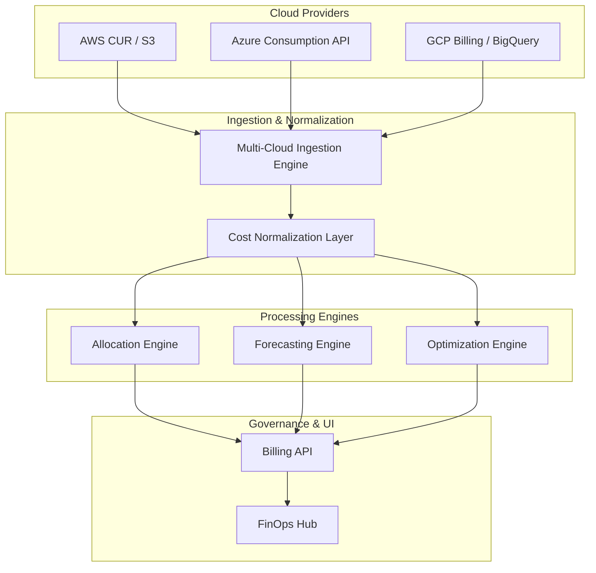

### 2. Cost Normalization Flow
*How the platform converts provider-specific data into a unified model.*
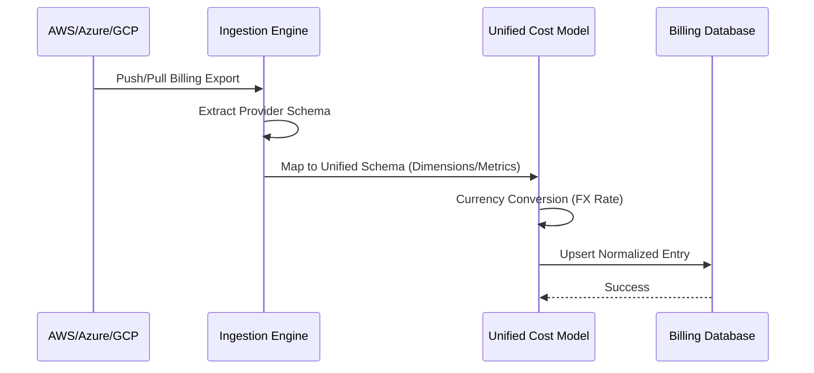

### 3. Tag-Based Cost Allocation Lifecycle
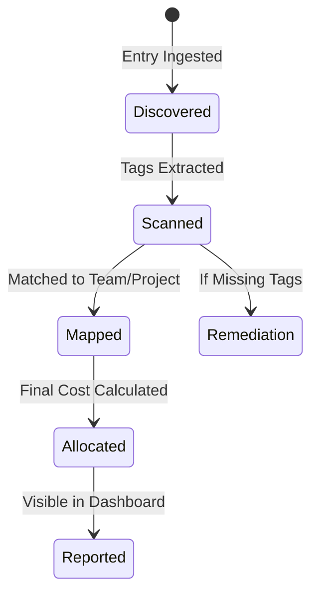

### 4. Predictive Forecasting Logic
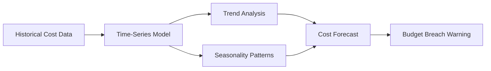

### 5. Multi-Cloud Budget Guardrails
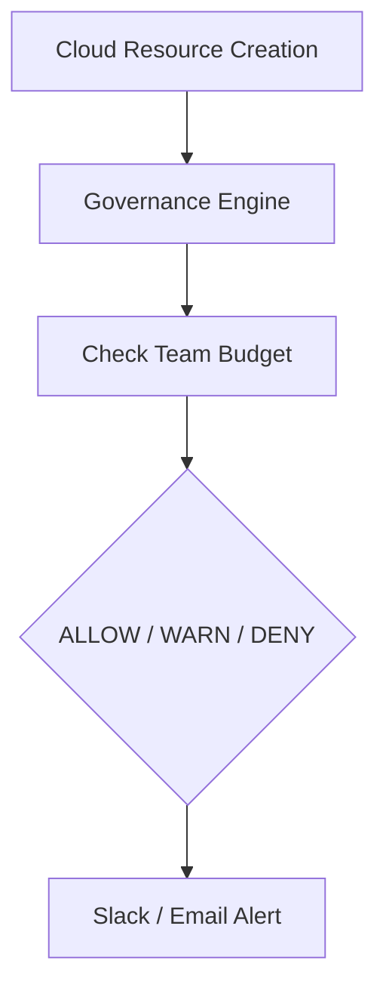

### 6. Savings Recommendation Pipeline
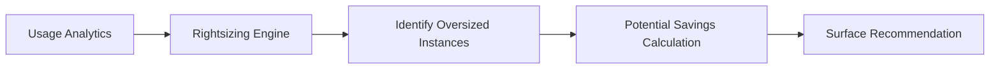

### 7. Unit Economics Mapping
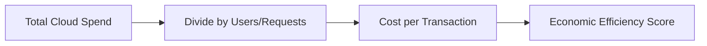

### 8. Chargeback / Showback Flow
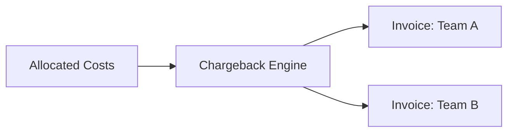

### 9. Anomaly Detection Workflow
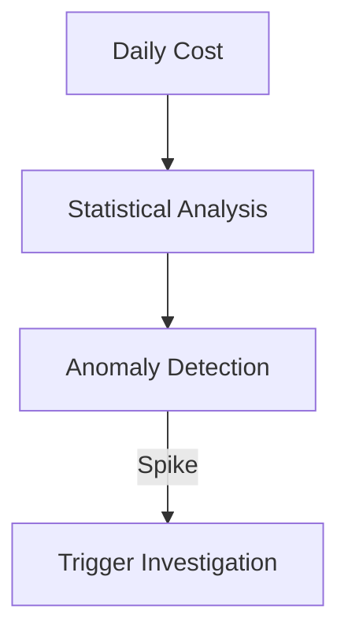

### 10. Executive FinOps Dashboard
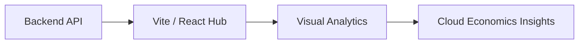

### 11. Multi-cloud billing flow
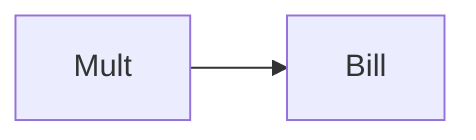

### 12. Cost ingestion flow
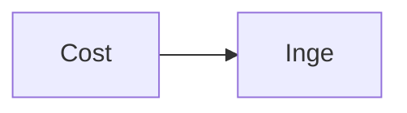

### 13. Cost allocation flow
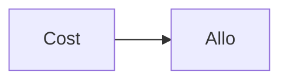

### 14. Cost normalization flow
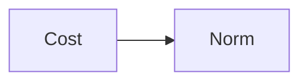

### 15. Forecasting pipeline
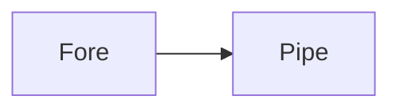

### 16. Optimization engine flow
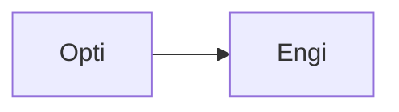

### 17. Budget tracking flow
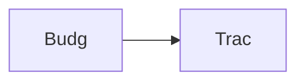

### 18. Anomaly detection flow
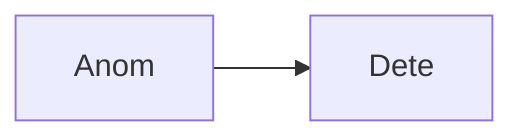

### 19. Governance policy flow
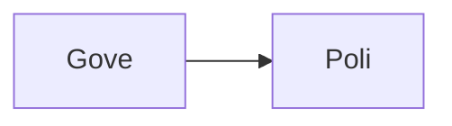

### 20. Chargeback lifecycle
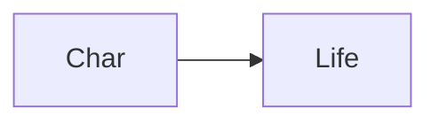

### 21. Showback lifecycle
```mermaid
graph LR
    S[Show] --> L[Life]
```

### 22. Unit economics model
```mermaid
graph LR
    U[Unit] --> E[Econ]
```

### 23. Tag-based attribution
```mermaid
graph LR
    T[Tagb] --> A[Attr]
```

### 24. Savings recommendation flow
```mermaid
graph LR
    S[Savi] --> R[Reco]
```

### 25. RI vs On-demand analysis
```mermaid
graph LR
    R[RIvs] --> O[Onde]
```

### 26. Multi-tenant isolation
```mermaid
graph LR
    M[Mult] --> I[Isol]
```

### 27. FinOps SDK map
```mermaid
graph LR
    F[FinO] --> S[SDKm]
```

### 28. Infrastructure: Kubernetes
```mermaid
graph LR
    I[Infr] --> K[Kube]
```

### 29. Infrastructure: Database
```mermaid
graph LR
    I[Infr] --> D[Data]
```

### 30. Infrastructure: Redis
```mermaid
graph LR
    I[Infr] --> R[Redi]
```

### 31. Infrastructure: Monitoring
```mermaid
graph LR
    I[Infr] --> M[Moni]
```

### 32. Monitoring: Prometheus
```mermaid
graph LR
    M[Moni] --> P[Prom]
```

### 33. Monitoring: Grafana
```mermaid
graph LR
    M[Moni] --> G[Graf]
```

### 34. Monitoring: Alerts
```mermaid
graph LR
    M[Moni] --> A[Aler]
```

### 35. CI/CD: Build pipeline
```mermaid
graph LR
    C[CICD] --> B[Buil]
```

### 36. CI/CD: Test pipeline
```mermaid
graph LR
    C[CICD] --> T[Test]
```

### 37. CI/CD: Deploy pipeline
```mermaid
graph LR
    C[CICD] --> D[Depl]
```

### 38. Frontend: Dashboard
```mermaid
graph LR
    F[Fron] --> D[Dash]
```

### 39. Frontend: Breakdown
```mermaid
graph LR
    F[Fron] --> B[Brea]
```

### 40. Frontend: Forecast
```mermaid
graph LR
    F[Fron] --> F[Fore]
```

### 41. API: Auth flow
```mermaid
graph LR
    A[API] --> A[Auth]
```

### 42. API: Cost summary
```mermaid
graph LR
    A[API] --> C[Cost]
```

### 43. API: Forecast data
```mermaid
graph LR
    A[API] --> F[Fore]
```

### 44. API: Budget status
```mermaid
graph LR
    A[API] --> B[Budg]
```

### 45. Worker: Ingestion
```mermaid
graph LR
    W[Work] --> I[Inge]
```

### 46. Worker: Allocation
```mermaid
graph LR
    W[Work] --> A[Allo]
```

### 47. Worker: Optimization
```mermaid
graph LR
    W[Work] --> O[Opti]
```

### 48. Worker: Notification
```mermaid
graph LR
    W[Work] --> N[Noti]
```

### 49. Collector: AWS
```mermaid
graph LR
    C[Coll] --> A[AWSb]
```

### 50. Collector: Azure
```mermaid
graph LR
    C[Coll] --> A[Azur]
```

### 51. Collector: GCP
```mermaid
graph LR
    C[Coll] --> G[GCPb]
```

### 52. Policy: Budgeting
```mermaid
graph LR
    P[Poli] --> B[Budg]
```

### 53. Policy: Tagging
```mermaid
graph LR
    P[Poli] --> T[Tagg]
```

### 54. Integration: Billing API
```mermaid
graph LR
    I[Inte] --> B[Bill]
```

### 55. Integration: Pricing API
```mermaid
graph LR
    I[Inte] --> P[Pric]
```

### 56. Report: Executive
```mermaid
graph LR
    R[Repo] --> E[Exec]
```

### 57. Report: Team-level
```mermaid
graph LR
    R[Repo] --> T[Team]
```

### 58. Script: Ingest
```mermaid
graph LR
    S[Scri] --> I[Inge]
```

### 59. Script: Analyze
```mermaid
graph LR
    S[Scri] --> A[Anal]
```

### 60. Script: Report
```mermaid
graph LR
    S[Scri] --> R[Repo]
```

### 61. Security: RBAC
```mermaid
graph LR
    S[Secu] --> R[RBAC]
```

### 62. Security: Isolation
```mermaid
graph LR
    S[Secu] --> I[Isol]
```

### 63. Metrics tracking
```mermaid
graph LR
    M[Metr] --> T[Trac]
```

### 64. KPI tracking: Spend
```mermaid
graph LR
    K[KPI] --> S[Spen]
```

### 65. KPI tracking: Savings
```mermaid
graph LR
    K[KPI] --> S[Savi]
```

### 66. Optimization roadmap
```mermaid
graph LR
    O[Opti] --> R[Road]
```

### 67. Value realization
```mermaid
graph LR
    V[Valu] --> R[Real]
```

### 68. Institutional maturity
```mermaid
graph LR
    I[Inst] --> M[Matu]
```

### 69. Strategy execution
```mermaid
graph LR
    S[Stra] --> E[Exec]
```

### 70. Ecosystem map
```mermaid
graph LR
    E[Ecos] --> M[Map]
```

### 71. Supply chain of cost
```mermaid
graph LR
    S[Supp] --> C[Cost]
```

### 72. FinOps blueprint
```mermaid
graph LR
    F[FinO] --> B[Blue]
```

### 73. Zero waste model
```mermaid
graph LR
    Z[Zero] --> M[Map]
```

### 74. Transformation roadmap
```mermaid
graph LR
    T[Tran] --> R[Road]
```

### 75. Value realization model
```mermaid
graph LR
    V[Valu] --> R[Real]
```

### 76. Governance audit trail
```mermaid
graph LR
    G[Govn] --> A[Audi]
```

### 77. Security RBAC flow
```mermaid
graph LR
    S[Secu] --> R[RBAC]
```

### 78. Compliance validation
```mermaid
graph LR
    C[Comp] --> V[Vali]
```

### 79. Billing boundary check
```mermaid
graph LR
    B[Bill] --> B[Boun]
```

### 80. Executive summary hub
```mermaid
graph LR
    E[Exec] --> H[Hub]
```

---

## 🛠️ Technical Stack & Implementation

### FinOps & Optimization Engine
- **Processing**: Python 3.11+ / FastAPI / Pandas.
- **Normalization**: Unified Billing Schema (FinOps Open Cost & Usage Specification).
- **Optimization**: Rule-based Rightsizing and RI/SP Coverage Analysis.

### Frontend (FinOps Command Center)
- **Framework**: React 18 / Vite
- **Visuals**: Recharts (Spend Trends, Breakdown, Forecast, Budget Tracking).
- **Theme**: Dark, Gold, and Slate (Institutional FinOps Aesthetics).

### Infrastructure
- **Cloud**: Multi-Cloud (AWS, Azure, GCP), AWS EKS (Runtime), RDS (Persistence).
- **IaC**: Terraform (VPC, K8s, RDS, Redis, IAM).

---

## 🚀 Deployment Guide

### Local Development
```bash
# Clone the repository
git clone https://github.com/devopstrio/multicloud-billing-dashboard.git
cd multicloud-billing-dashboard

# Setup environment
cp .env.example .env

# Launch the billing dashboard stack
make up
```
Access the FinOps Hub at `http://localhost:3000`.

---

## 📜 License
Distributed under the MIT License. See `LICENSE` for more information.
