<div align="center">


<h1>Multi-Cloud Billing Dashboard</h1>

<p><strong>The Institutional-Grade Platform for Global FinOps, Multi-Cloud Cost Optimization, and Cloud Economics Orchestration.</strong></p>

[]()
[]()
[]()

<br/>

> **"Visibility is the first pillar of FinOps; Optimization is the goal."** 
> **Multi-Cloud Billing Dashboard** is an enterprise-grade platform designed to provide a secure, measurable, and highly automated foundation for global cloud economics. It orchestrates the complex lifecycle of cloud spend—from multi-cloud billing ingestion and standardized normalization to automated cost attribution and unified FinOps-driven governance.

</div>

---

## 🏛️ Executive Summary

Fragmented billing data and invisible cloud expenses are strategic operational liabilities; lack of centralized cost visibility is a primary barrier to organizational efficiency. Organizations fail to maintain a lean cloud budget not because of a lack of savings, but because of fragmented data standards, lack of automated attribution, and an inability to orchestrate cloud economics with operational precision.

This platform provides the **Financial Intelligence Plane**. It implements a complete **Enterprise FinOps-as-Code Framework**, enabling Finance and Engineering teams to manage cloud spend as a first-class citizen. By automating the normalization of disparate billing exports and orchestrating real-time cost attribution, we ensure that every organizational asset—from global edge CDNs to backend data lakes—is cost-accounted for by default, audited for history, and strictly aligned with institutional cloud spending frameworks.

---

## 📐 Architecture Storytelling: Principal Reference Models

### 1. Principal Architecture: Global Multi-Cloud Billing & Financial Intelligence Plane
This diagram illustrates the end-to-end flow from multi-cloud billing ingestion and data normalization to cost attribution, optimization, and institutional FinOps auditing.

```mermaid
graph LR
    %% Subgraph Definitions
    subgraph BillingIngress["Billing & Usage Ingress"]
        direction TB
        AWSCUR["AWS CUR (S3)"]
        AzureCost["Azure Consumption API"]
        GCPBilling["GCP Billing (BigQuery)"]
    end

    subgraph IntelligenceEngine["Financial Intelligence Hub"]
        direction TB
        API["FastAPI FinOps Gateway"]
        Normalizer["Billing Schema Normalizer"]
        Attributor["Cost & Tag Attributor"]
        Optimizer["Savings & RI Optimizer"]
    end

    subgraph AnalyticsPlane["Economic Visualization Mesh"]
        direction TB
        Dashboards["Unified Cost Dashboards"]
        Anomalies["Spend Spike Detector"]
        Forecasts["Predictive Spend Engine"]
    end

    subgraph OperationsHub["Institutional FinOps Hub"]
        direction TB
        Scorecard["Financial Health Score"]
        Analytics["Spend & Efficiency Stats"]
        Audit["Forensic Billing Metadata Lake"]
    end

    subgraph DevOps["FinOps-as-Code Orchestration"]
        direction TB
        TF["Terraform FinOps Modules"]
        Policy["Cost Governance Policy"]
        ChatOps["FinOps Approval Hub"]
    end

    %% Flow Arrows
    BillingIngress -->|1. Ingest Raw Data| API
    API -->|2. Normalize Schema| Normalizer
    Normalizer -->|3. Attribute Cost| Attributor
    Attributor -->|4. Optimize Commit| Optimizer
    
    Optimizer -->|5. Store Metrics| AnalyticsPlane
    AnalyticsPlane -->|6. Visualize spend| OperationsHub
    Optimizer -->|7. Trigger Purchase| DevOps
    
    API -->|8. Visualize Health| Scorecard
    Scorecard -->|9. Track Budget| Analytics
    Scorecard -->|10. Record Result| Audit
    
    TF -->|11. Provision Hub| IntelligenceEngine
    Policy -->|12. Enforce Budgets| Optimizer
    Audit -->|13. Improve Forecasts| AnalyticsPlane

    %% Styling
    classDef ingress fill:#f5f5f5,stroke:#616161,stroke-width:2px;
    classDef intel fill:#fff9c4,stroke:#fbc02d,stroke-width:2px;
    classDef analytics fill:#e1f5fe,stroke:#01579b,stroke-width:2px;
    classDef ops fill:#ede7f6,stroke:#311b92,stroke-width:2px;
    classDef devops fill:#e8f5e9,stroke:#1b5e20,stroke-width:2px;

    class BillingIngress ingress;
    class IntelligenceEngine intel;
    class AnalyticsPlane analytics;
    class OperationsHub ops;
    class DevOps devops;
```

### 2. The Billing Telemetry Lifecycle Flow
The continuous path of a billing record from initial ingestion and normalization to active enrichment, attribution, and institutional forensic auditing.

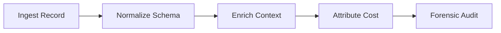

### 3. Cross-Cloud Cost Aggregation Topology
Strategically centralizing disparate provider billing formats (AWS CUR, Azure Cost Management, GCP Billing Export) into a unified institutional model for global spend analysis.

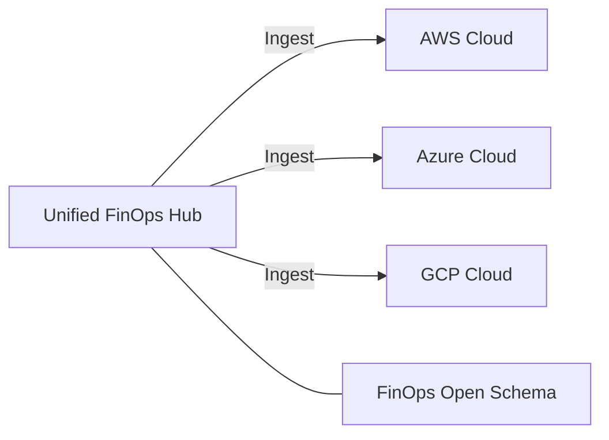

### 4. Cost Attribution & Tagging Logic Flow
Mapping raw billing line items to specific Business Units, Projects, and Cost Centers using a combination of resource tags, hierarchy rules, and identity context.

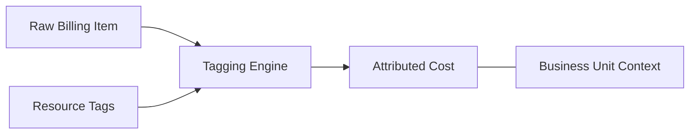

### 5. Reserved Instance & Savings Plan Optimization Flow
Identifying opportunities for commit-based savings by analyzing historical usage patterns and recommending the optimal mix of Reserved Instances and Savings Plans.

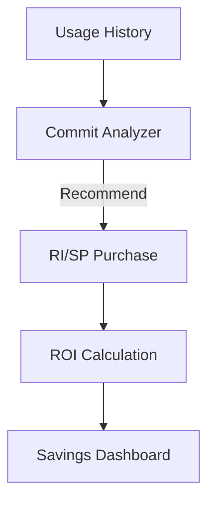

### 6. Anomaly Detection & Spend Guardrail Flow
Using machine learning to identify sudden, unexpected spikes in cloud spend and alerting stakeholders before budget thresholds are breached.

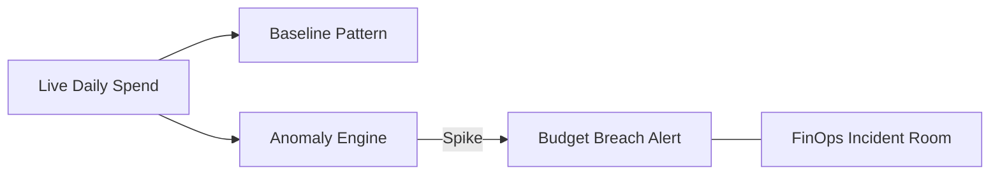

### 7. Institutional Financial Scorecard
Grading organizational performance based on key financial indicators: Budget Accuracy, Cost Efficiency (Wastage), and Reserved Instance Coverage.

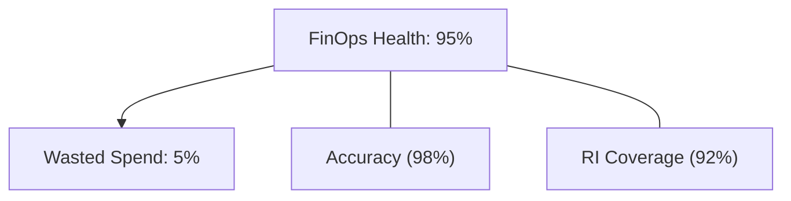

### 8. Identity & RBAC for FinOps Governance
Managing fine-grained access to cost dashboards, savings recommendations, and budget policies between CFOs, FinOps Analysts, and Engineering Managers.

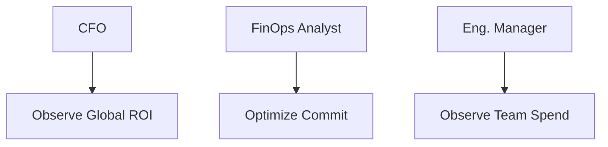

### 9. IaC Deployment: FinOps-as-Code Framework
Using modular Terraform to deploy and manage the versioned distribution of the billing hubs, data processors, and forensic metadata lakes.

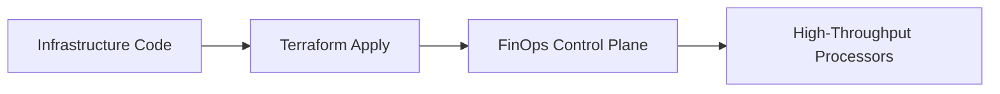

### 10. AIOps Forecast & Trend Validation Flow
Using advanced time-series modeling to predict future cloud spend based on historical growth patterns, seasonal variations, and planned infrastructure changes.

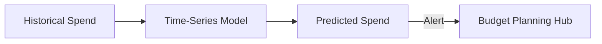

### 11. Metadata Lake for Forensic Financial Audit
Storing long-term records of every billing line item, adjustment, and optimization decision for institutional record-keeping, compliance auditing, and post-incident forensics.

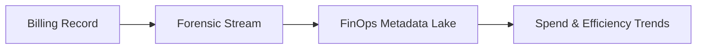

---

## 🏛️ Core FinOps Pillars

1.  **Multi-Cloud Cost Normalization**: Abstracting provider-specific billing formats into a unified institutional model.
2.  **Automated Cost Attribution**: Driving 100% accountability through tag-based and rule-based allocation.
3.  **Predictive Spend Analytics**: Reducing financial risk through machine-learning-driven cost forecasting.
4.  **Real-Time Anomaly Detection**: Identifying and alerting on unexpected spend spikes within 24 hours.
5.  **Commitment Optimization**: Maximizing ROI through automated RI and Savings Plan recommendations.
6.  **Full Financial Auditability**: Immutable recording of every billing event and optimization decision for institutional forensics.

---

## 🛠️ Technical Stack & Implementation

### FinOps Engine & APIs
*   **Framework**: Python 3.11+ / FastAPI.
*   **Data Engine**: High-performance billing processing using Pandas and DuckDB.
*   **Normalization Hub**: Implementation of the FinOps Open Cost & Usage Specification (FOCUS).
*   **Persistence**: PostgreSQL (Metadata Lake) and Redis (Live Anomaly Cache).
*   **Auth Orchestrator**: Federated OIDC/SAML for least-privilege financial data access.

### FinOps Dashboard (UI)
*   **Framework**: React 18 / Vite.
*   **Theme**: Dark, Gold, Slate (Modern high-fidelity financial aesthetic).
*   **Visualization**: Recharts for spend trends, cost breakdowns, and ROI analytics.

### Infrastructure & DevOps
*   **Runtime**: AWS EKS or Azure Kubernetes Service (AKS).
*   **Data Plane**: Ingestion from AWS CUR (S3), Azure Cost Management API, and GCP Billing Export (BigQuery).
*   **IaC**: Modular Terraform for deploying the FinOps hub and data processing distributions.

---

## 🏗️ IaC Mapping (Module Structure)

| Module | Purpose | Real Services |
| :--- | :--- | :--- |
| **`infrastructure/finops_hub`** | Central management plane | EKS, PostgreSQL, Redis |
| **`infrastructure/ingestion`** | Provider billing collectors | Lambda, S3, BigQuery |
| **`infrastructure/analysis`** | Normalization & Attribution | Spark, Flink, Python |
| **`infrastructure/auditing`** | Forensic financial sinks | S3, Athena, Quicksight |

---

## 🚀 Deployment Guide

### Local Principal Environment
```bash
# Clone the FinOps platform
git clone https://github.com/devopstrio/multicloud-billing-dashboard.git
cd multicloud-billing-dashboard

# Configure environment
cp .env.example .env

# Launch the FinOps stack
make init

# Trigger a mock multi-cloud billing ingestion and normalization simulation
make simulate-billing
```

Access the FinOps Hub at `http://localhost:3000`.

---

## 📜 License
Distributed under the MIT License. See `LICENSE` for more information.

---
<div align="center">
  <p>© 2026 Devopstrio. All rights reserved.</p>
</div>
