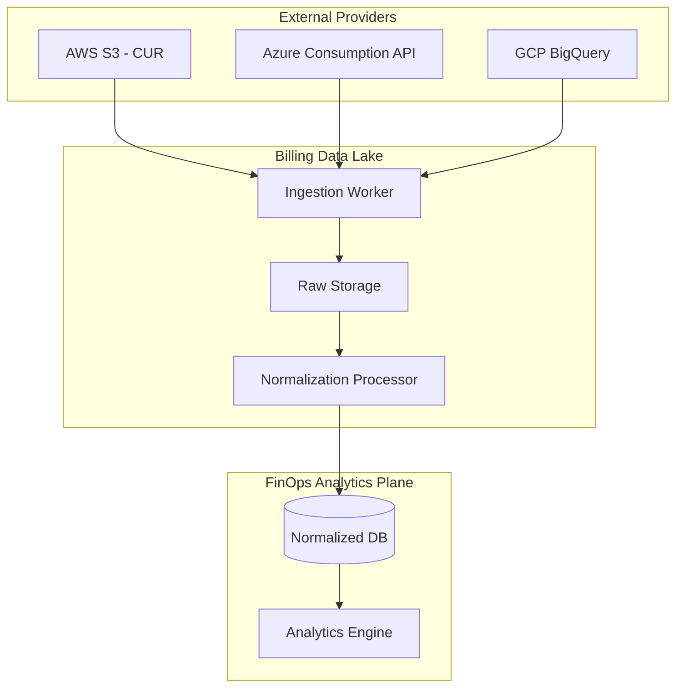
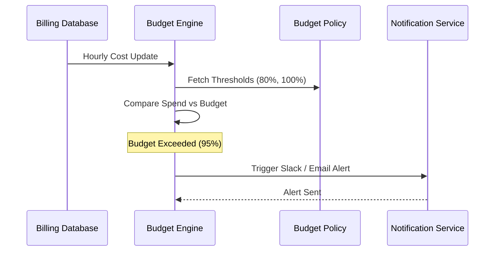
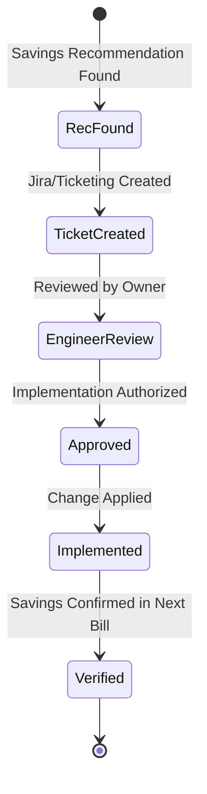

# Architecture & Data Flow Diagrams

## 31. Multi-cloud Ingestion Hub Architecture

```mermaid
graph TD
    subgraph "External Providers"
        AWS_S3[AWS S3 - CUR]
        AZ_API[Azure Consumption API]
        GCP_BQ[GCP BigQuery]
    end
    subgraph "Billing Data Lake"
        Ingest[Ingestion Worker]
        Raw[Raw Storage]
        Process[Normalization Processor]
    end
    subgraph "FinOps Analytics Plane"
        Analytics[Analytics Engine]
        DB[(Normalized DB)]
    end

    AWS_S3 --> Ingest
    AZ_API --> Ingest
    GCP_BQ --> Ingest
    Ingest --> Raw
    Raw --> Process
    Process --> DB
    DB --> Analytics
```

## 40. Automated Budget Alert Flow

```mermaid
sequenceDiagram
    participant DB as Billing Database
    participant Engine as Budget Engine
    participant Policy as Budget Policy
    participant Notif as Notification Service

    DB->>Engine: Hourly Cost Update
    Engine->>Policy: Fetch Thresholds (80%, 100%)
    Engine->>Engine: Compare Spend vs Budget
    Note over Engine: Budget Exceeded (95%)
    Engine->>Notif: Trigger Slack / Email Alert
    Notif-->>Engine: Alert Sent
```

## 50. Optimization Implementation Flow

```mermaid
stateDiagram-v2
    [*] --> RecFound: Savings Recommendation Found
    RecFound --> TicketCreated: Jira/Ticketing Created
    TicketCreated --> EngineerReview: Reviewed by Owner
    EngineerReview --> Approved: Implementation Authorized
    Approved --> Implemented: Change Applied
    Implemented --> Verified: Savings Confirmed in Next Bill
    Verified --> [*]
```
