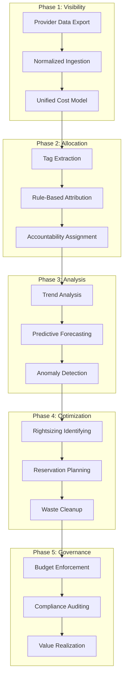
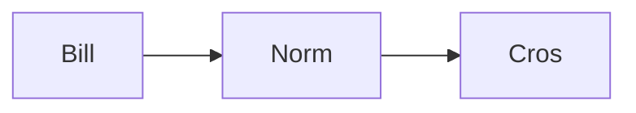
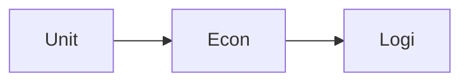

# FinOps & Billing Diagrams

## 11. Industrial FinOps Lifecycle (Detailed)
*The end-to-end orchestration of cloud economics and cost optimization.*



## 15. Cross-cloud billing normalization flow


## 20. Savings recommendation state machine
```mermaid
graph TD
    Identify[Identify Opportunity] --> Analyze[Analyze Impact]
    Analyze --> Surface[Surface to User]
    Surface -->|Applied| Verify[Verify Savings]
    Surface -->|Rejected| Archive[Archive]
    Verify --> [*]
```

## 25. Unit economics calculation logic

